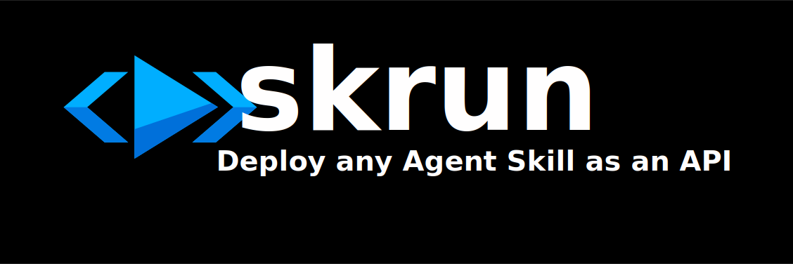

<p align="center">
  
</p>

<p align="center">
  <a href="https://github.com/skrun-dev/skrun/actions"></a>
  <a href="https://www.npmjs.com/package/@skrun-dev/cli"></a>
  <a href="LICENSE"></a>
</p>

<p align="center">
  <b>The open, multi-model agent runtime.</b><br>
  Turn any AI agent skill into a production API — with streaming, typed SDK, and zero vendor lock-in.
</p>

<p align="center">
  <a href="#quick-start">Quick Start</a> &middot;
  <a href="#sdk">SDK</a> &middot;
  <a href="http://localhost:4000/docs">Interactive Docs</a> &middot;
  <a href="docs/api.md">API Reference</a> &middot;
  <a href="#demo-agents">Examples</a>
</p>

---

## Why Skrun?

Every major LLM provider is building their own agent runtime — locked to their models. Skrun is the **open alternative**: same agent, any LLM, your infrastructure.

| | Skrun | Vendor runtimes |
|--|-------|-----------------|
| Models | Anthropic, OpenAI, Google, Mistral, Groq, DeepSeek, Kimi, Qwen + any OpenAI-compatible endpoint | One provider only |
| Deployment | Self-hosted or cloud (coming soon) | Vendor cloud only |
| Format | [Agent Skills](https://agentskills.io) (SKILL.md) — works with Claude Code, Copilot, Codex | Proprietary |
| Streaming | SSE + async webhooks | Varies |
| Open source | MIT | No |

## Quick Start

```bash
npm install -g @skrun-dev/cli

skrun init --from-skill ./my-skill    # import an existing skill
skrun deploy                           # build + push + get your API endpoint
```

That's it. Your agent is now callable via `POST /run`:

```bash
curl -X POST http://localhost:4000/api/agents/dev/my-skill/run \
  -H "Authorization: Bearer dev-token" \
  -H "Content-Type: application/json" \
  -d '{"input": {"query": "analyze this"}}'
```

## Features

| Feature | Description |
|---------|-------------|
| **Multi-model** | 5 built-in providers + any OpenAI-compatible endpoint (DeepSeek, Kimi, Qwen, Ollama, vLLM...) — with automatic fallback |
| **Streaming** | SSE real-time events (`run_start` → `tool_call` → `run_complete`) + async webhooks |
| **Typed SDK** | `npm install @skrun-dev/sdk` — `run()`, `stream()`, `runAsync()` + 6 more methods |
| **Tool calling** | Local scripts (`scripts/`) + MCP servers (`npx`) — same ecosystem as Claude Desktop |
| **Stateful** | Agents remember across runs via key-value state |
| **Interactive docs** | OpenAPI 3.1 schema + Scalar explorer at `GET /docs` |
| **Caller keys** | Users bring their own LLM keys via `X-LLM-API-Key` — zero cost for operators |
| **Agent verification** | Verified flag controls script execution — safe for third-party agents |

## SDK

```bash
npm install @skrun-dev/sdk
```

```typescript
import { SkrunClient } from "@skrun-dev/sdk";

const client = new SkrunClient({
  baseUrl: "http://localhost:4000",
  token: "dev-token",
});

// Sync — get the result
const result = await client.run("dev/code-review", { code: "const x = 1;" });
console.log(result.output);

// Stream — real-time events
for await (const event of client.stream("dev/code-review", { code: "..." })) {
  console.log(event.type); // run_start, tool_call, llm_complete, run_complete
}

// Async — fire and forget
const { run_id } = await client.runAsync("dev/agent", input, "https://your-app.com/hook");
```

9 methods: `run`, `stream`, `runAsync`, `push`, `pull`, `list`, `getAgent`, `getVersions`, `verify`. Zero dependencies, Node.js 18+.

## Demo Agents

| Agent | What it shows |
|-------|--------------|
| [code-review](examples/code-review/) | Import a skill, get a code quality API |
| [pdf-processing](examples/pdf-processing/) | Tool calling with local scripts |
| [seo-audit](examples/seo-audit/) | **Stateful** — run twice, it remembers and compares |
| [data-analyst](examples/data-analyst/) | Typed I/O — CSV in, structured insights out |
| [email-drafter](examples/email-drafter/) | Business use case — non-dev API consumer |
| [web-scraper](examples/web-scraper/) | **MCP server** — headless browser via @playwright/mcp |

<details>
<summary><b>Try an example</b></summary>

```bash
# 1. Start the registry
cp .env.example .env          # add your GOOGLE_API_KEY
pnpm dev:registry              # keep this terminal open

# 2. In another terminal
skrun login --token dev-token
cd examples/code-review
skrun build && skrun push

# 3. Call the agent
curl -X POST http://localhost:4000/api/agents/dev/code-review/run \
  -H "Authorization: Bearer dev-token" \
  -H "Content-Type: application/json" \
  -d '{"input": {"code": "function add(a,b) { return a + b; }"}}'
```

> **Windows (PowerShell):** use `curl.exe` instead of `curl`, and use `@input.json` for the body.

</details>

## CLI

| Command | Description |
|---------|-------------|
| `skrun init [dir]` | Create a new agent |
| `skrun init --from-skill <path>` | Import existing skill |
| `skrun dev` | Local server with POST /run |
| `skrun test` | Run agent tests |
| `skrun build` | Package .agent bundle |
| `skrun deploy` | Build + push + live URL |
| `skrun push` / `pull` | Registry upload/download |
| `skrun login` / `logout` | Authentication |
| `skrun logs <agent>` | Execution logs |

## Key Concepts

- **[Agent Skills](https://agentskills.io)** — SKILL.md standard, compatible with Claude Code, Copilot, Codex
- **[agent.yaml](docs/agent-yaml.md)** — Runtime config: model, inputs/outputs, permissions, state, tests
- **[POST /run](docs/api.md)** — Every agent is an API. Typed inputs, structured outputs.

## Documentation

- [Interactive API explorer](http://localhost:4000/docs) — live "Try it" interface (start the registry first)
- [OpenAPI schema](http://localhost:4000/openapi.json) — import into Postman/Insomnia
- [API reference](docs/api.md)
- [agent.yaml specification](docs/agent-yaml.md)
- [CLI reference](docs/cli.md)
- [Contributing](CONTRIBUTING.md)

## Contributing

```bash
git clone https://github.com/skrun-dev/skrun.git
cd skrun
pnpm install && pnpm build && pnpm test
```

See [CONTRIBUTING.md](CONTRIBUTING.md) for conventions and setup.

## License

[MIT](LICENSE)
